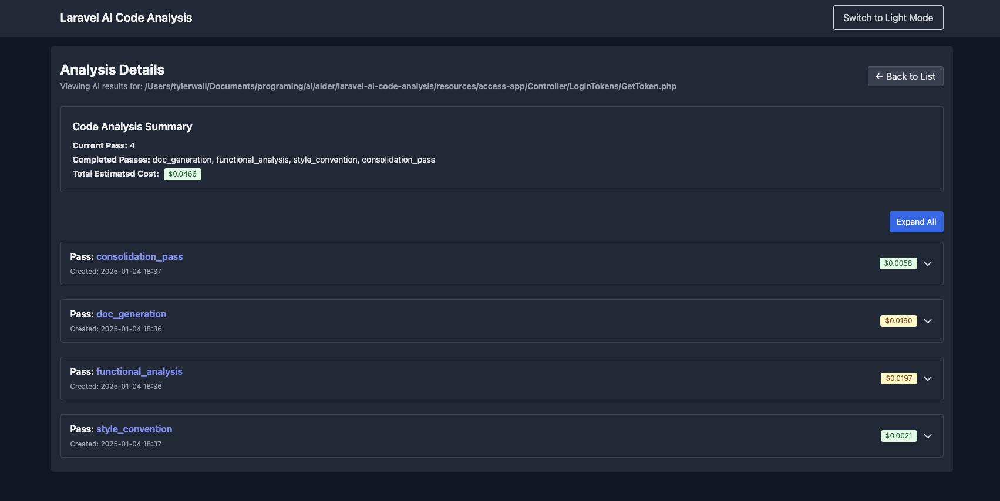
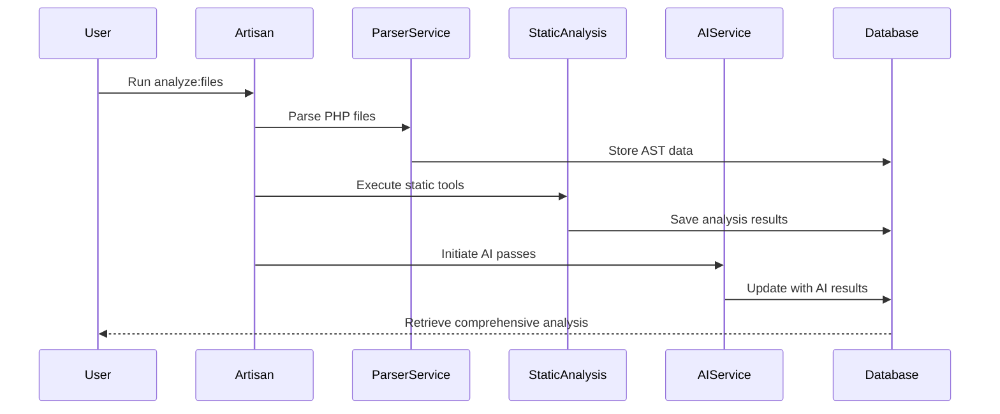
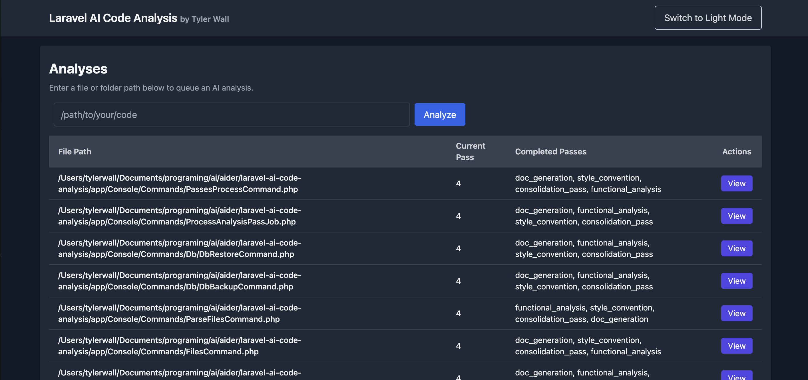
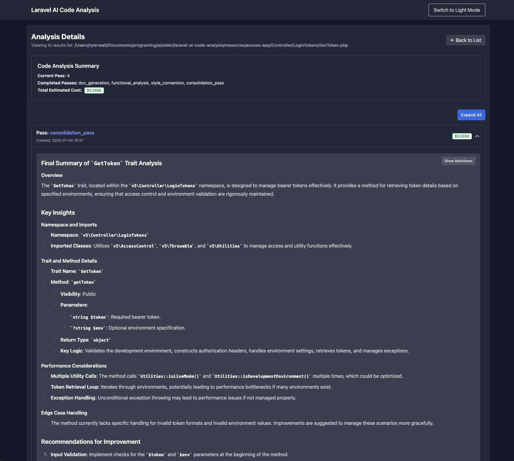
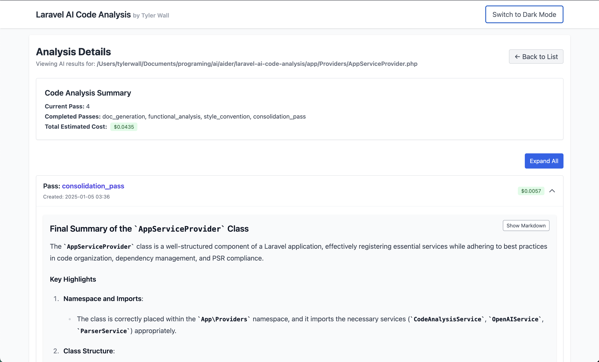

# Laravel AI Code Analysis Project

[](LICENSE)
[](https://github.com/wallter)
[](https://www.linkedin.com/in/tylerrwall/)

## Overview

```mermaid
graph TD
    A[PHP Codebase] --> B[ParserService]
    B --> C[Abstract Syntax Tree (AST) Data]
    C --> D[Static Analysis Tools]
    C --> E[AI Analysis]
    D --> F[PHPStan, PHP_CodeSniffer, Psalm]
    E --> G[Multi-Pass AI Operations]
    G --> H[Documentation Generation]
    G --> I[Refactoring Suggestions]
    G --> J[Functionality Assessments]
    H --> K[Database Storage]
    I --> K
    J --> K
```

This Laravel-based project seamlessly integrates **OpenAI’s language models** with **PHP Abstract Syntax Tree (AST) analysis** (powered by [nikic/php-parser](https://github.com/nikic/PHP-Parser)) along with other essential tooling such as [PHPStan](https://phpstan.org/), [PHP_CodeSniffer](https://github.com/squizlabs/PHP_CodeSniffer), and [Psalm](https://psalm.dev/) to deliver a **comprehensive multi-pass code analysis**. By iteratively scanning PHP codebases, the system generates:

- **Automated Documentation**: Creates concise and clear documentation derived from raw code and AST data, enhancing code comprehension and maintainability.
- **Refactoring Suggestions**: Provides actionable recommendations to improve code clarity, adhere to best practices, and optimize overall structure.
- **Functionality Assessments**: Evaluates performance and maintainability aspects of the code, identifying potential bottlenecks and areas for improvement.



By leveraging **queued** AI operations, **token usage** tracking, and other advanced features, developers can **enhance maintainability**, **optimize performance**, and **ensure** cleaner, more efficient codebases (see `config/ai.php`).

## Table of Contents

- [Laravel AI Code Analysis Project](#laravel-ai-code-analysis-project)
  - [Overview](#overview)
  - [Table of Contents](#table-of-contents)
  - [Usage TLDR;](#usage-tldr)
    - [Running the UI \& Server](#running-the-ui--server)
  - [Features](#features)
    - [Code Parsing and Analysis](#code-parsing-and-analysis)
    - [Multi-Pass AI Analysis](#multi-pass-ai-analysis)
    - [Artisan Commands](#artisan-commands)
  - [Requirements](#requirements)
  - [Installation](#installation)
  - [UI Setup](#ui-setup)
  - [Configuration](#configuration)
    - [AI Service Configuration](#ai-service-configuration)
    - [Parsing Configuration](#parsing-configuration)
  - [Usage](#usage)
    - [Artisan Commands](#artisan-commands-1)
    - [Token \& Cost Tracking](#token--cost-tracking)
    - [Queued Analysis](#queued-analysis)
    - [Testing](#testing)
  - [Testing](#testing-1)
  - [Screenshots](#screenshots)
    - [Code Analysis Dashboard](#code-analysis-dashboard)
    - [Documentation Generation](#documentation-generation)
  - [Demo Output](#demo-output)
    - [Final Summary of Analysis for `ParseFilesCommand`](#final-summary-of-analysis-for-parsefilescommand)
    - [Strengths](#strengths)
    - [Areas for Improvement](#areas-for-improvement)
      - [Functionality Enhancements](#functionality-enhancements)
      - [Performance Optimizations](#performance-optimizations)
      - [Code Quality Improvements](#code-quality-improvements)
    - [Overall Rating and Recommendations](#overall-rating-and-recommendations)
  - [Contributing](#contributing)
  - [License](#license)

## Usage TLDR;
```bash
composer install
npm install

# 1) Set up your .env with OPENAI_API_KEY, choose model
cp .env.example .env
php artisan key:generate

# 2) Migrate DB
php artisan migrate:fresh

# 3) Set your file/folder scanning in config/parsing.php

# 4) Parse code, store results:
php artisan parse:files

# 5) Run static analysis tools:
php artisan static-analysis:run {code_analysis_id} --tools=PHPStan,PHP_CodeSniffer,Psalm

# 6) Analyze code, queue AI passes:
php artisan analyze:files

# 7) Run the custom command (with a progressbar) to process the async jobs
php artisan queue:progress

# Or just run a queue worker

# php artisan queue:work
```
- Check console output

### Running the UI & Server

Start the Laravel development server to run the application locally:

```bash
php artisan serve
```

The server will start at [http://localhost:8000](http://localhost:8000) by default. You can access the application by navigating to this URL in your web browser.
- Monitor Laravel logs `storage/logs/laravel.log` for detailed output

## Features

```mermaid
graph TB
    subgraph Tooling
        A[PHPStan]
        B[PHP_CodeSniffer]
        C[Psalm]
        D[Laravel Tinker]
        E[OpenAI-PHP/Laravel]
    end

    subgraph Code Parsing and Analysis
        F[Comprehensive Parsing]
        G[AST Insights]
        H[Granular Metadata]
        I[Persistent Tracking]
        J[Supports Advanced Use Cases]
    end

    subgraph Multi-Pass AI Analysis
        K[Documentation Generation]
        L[Refactoring Suggestions]
        M[Functionality Analysis]
        N[Style & Convention Review]
        O[Performance Analysis]
        P[Dependency Review]
        Q[AST Insights]
    end

    subgraph Artisan Commands
        R[parse:files]
        S[static-analysis:run]
        T[analyze:files]
        U[db:backup]
        V[db:backup:restore]
    end

    Tooling --> Code Parsing and Analysis
    Code Parsing and Analysis --> Multi-Pass AI Analysis
    Multi-Pass AI Analysis --> Artisan Commands
```

### Tooling

This project leverages a suite of powerful tools to enhance code analysis and maintainability:

- **[PHPStan](https://phpstan.org/):** A static analysis tool for PHP that focuses on finding bugs in your code without running it.
- **[PHP_CodeSniffer](https://github.com/squizlabs/PHP_CodeSniffer):** Detects violations of a defined coding standard in your PHP code.
- **[Psalm](https://psalm.dev/):** A static analysis tool for finding errors in PHP applications.
- **[Laravel Tinker](https://github.com/laravel/tinker):** An interactive REPL for the Laravel framework, aiding in debugging and testing.
- **[OpenAI-PHP/Laravel](https://github.com/openai-php/laravel):** Facilitates integration with OpenAI’s API for AI-driven features.

### Code Parsing and Analysis
- **Comprehensive Parsing:** Analyzes PHP files to extract detailed information about classes, methods, functions, traits, and annotations, providing a holistic view of the codebase.
- **Abstract Syntax Tree (AST) Insights:** Captures detailed AST data, including node types, attributes, and structural relationships, enabling advanced analysis of code structure and behavior.
- **Granular Metadata:** Extracts metadata such as namespaces, file paths, line numbers, and method parameters to facilitate in-depth understanding and precise debugging.
- **Persistent Tracking:** Stores parsed data in a database, allowing for historical tracking, cross-referencing, and analysis over time.
- **Supports Advanced Use Cases:** Enables scenarios like dependency mapping, identifying code smells, and generating tailored documentation or refactoring suggestions based on rich structural insights.

### Multi-Pass AI Analysis
  - **Documentation Generation:** Automatically creates concise, structured documentation from both AST data and raw code. Summarizes class purposes, key methods, parameters, and usage context with clarity.
  - **Refactoring Suggestions:** Offers actionable recommendations to improve code structure, maintainability, and adherence to SOLID principles, with a focus on reducing duplication and enhancing clarity.
  - **Functionality Analysis:** Evaluates the code for functional correctness, identifies edge cases, and highlights performance bottlenecks. Provides suggestions for enhancing scalability, reliability, and testability.
  - **Style & Convention Review:** Ensures adherence to PSR standards and highlights inconsistencies in formatting, naming conventions, and documentation. Recommends improvements for readability and consistency.
  - **Performance Analysis:** Identifies inefficiencies like redundant operations or excessive memory usage. Suggests optimizations such as caching, algorithmic improvements, or asynchronous processing.
  - **Dependency Review:** Analyses external dependencies for compatibility, security risks, and outdated packages. Recommends updates and alternatives for deprecated or inefficient libraries.
  - **AST Insights:** Provides insights into the code structure and relationships using Abstract Syntax Tree (AST) data, helping to understand and navigate the codebase effectively.

### Artisan Commands


  - **`parse:files`:** Parses configured files/directories to list discovered classes and functions.
  - **`static-analysis:run`**
  
    ```bash
    php artisan static-analysis:run {code_analysis_id} --tools=PHPStan,PHP_CodeSniffer,Psalm
    ```
  
    - **Description**: Runs the specified static analysis tools on a particular `CodeAnalysis` entry.
    - **Parameters**:
      - `{code_analysis_id}`: The ID of the `CodeAnalysis` record you wish to analyze.
    - **Options**:
      - `--tools`: Comma-separated list of static analysis tools to run (e.g., `PHPStan,PHP_CodeSniffer,Psalm`).
  
    **Example:**
  
    ```bash
    php artisan static-analysis:run 1 --tools=PHPStan,Psalm
    ```
  - **`code:analyze`:** Analyzes PHP files, gathers AST data, and applies AI-driven multi-pass analysis.
  
- **Database Management**
  - Utilizes SQLite for simplicity and ease of use.
  - Provides migration files to set up necessary database tables.
  
- **Logging with Contextual Information**
  - Implements detailed logging using Laravel's Context facade for enhanced traceability and debugging.

## Requirements

- **PHP:** >= 8.0
- **Composer:** To manage PHP dependencies.
- **Laravel:** Version 11.x
- **SQLite:** For the database.
- **OpenAI API Key:** To enable AI-driven features.

## Installation

1. **Clone the Repository**

   ```bash
   git clone https://github.com/your-username/laravel-ai-code-analysis.git
   cd laravel-ai-code-analysis
   ```

2. **Install Dependencies**

   ```bash
   composer install
   npm install
   ```

3. **Set Up Environment Variables**

   - Copy the example environment file and configure the necessary variables.

     ```bash
     cp .env.example .env
     ```

   - Open `.env` and set your `OPENAI_API_KEY` along with other configurations as needed.

4. **Generate Application Key**

   ```bash
   php artisan key:generate
   ```

5. **Run Migrations**

   ```bash
   php artisan migrate
   ```

## UI Setup

1. **Install Frontend Dependencies**

   Navigate to the `resources/js` directory and install the necessary npm packages:

   ```bash
   cd resources/js
   npm install
   ```

2. **Build Frontend Assets**

   Compile the frontend assets using Laravel Mix:

   ```bash
   npm run dev
   ```

   For production builds, use:

   ```bash
   npm run production
   ```

## Configuration

### AI Service Configuration

The AI capabilities are configured in `config/ai.php`. This file defines the AI operations, multi-pass analysis settings, static analysis tools, and default model configurations. Configure via `.env`.

- **API Credentials**

  ```php
  'openai_api_key' => env('OPENAI_API_KEY'),
  ```

- **Default AI Settings**

  ```php
  'default' => [
      'model'       => env('AI_DEFAULT_MODEL', 'gpt-4o-mini'),
      'max_tokens'  => env('AI_DEFAULT_MAX_TOKENS', 500),
      'temperature' => env('AI_DEFAULT_TEMPERATURE', 0.5),
      'system_message' => 'You are a helpful AI assistant.',
  ],
  ```

- **AI Operations**

  Define each AI operation with specific configurations.

  ```php
  'passes' => [

      'doc_generation' => [
          'operation_identifier' => OperationIdentifier::DOC_GENERATION->value,
          'model' => 'gpt-4o',
          'max_tokens' => env('AI_DOC_GENERATION_MAX_TOKENS', 1200),
          'temperature' => env('AI_DOC_GENERATION_TEMPERATURE', 0.25),
          'type' => PassType::BOTH->value,
          'system_message' => 'You generate concise PHP documentation from code and AST to complement phpdoc.',
          'prompt_sections' => [
              'base_prompt' => 'Analyze the following code:',
              'guidelines' => [
                  '- Create short but clear documentation from the AST data and raw code.',
                  '- Summarize the purpose, methods, parameters, and usage context.',
                  '- Avoid documenting __construct, getter, setter, and similar functions.',
                  '- Exclude comment code blocks from the documentation.',
                  '- Mention custom annotations, such as @url.',
                  '- Limit the documentation to approximately 200 words.',
              ],
              'response_format' => 'Provide concise, human-readable documentation.',
          ],
      ],

      // ... other passes ...

  ],
  ```

- **Static Analysis Tools Configuration**

  Define static analysis tools and their configurations.

  ```php
  'static_analysis_tools' => [
      'PHPStan' => [
          'enabled' => true,
          'command' => 'vendor/bin/phpstan',
          'options' => ['analyse', '--json'],
          'output_format' => 'json',
      ],
      'PHP_CodeSniffer' => [
          'enabled' => true,
          'command' => 'vendor/bin/phpcs',
          'options' => ['--report=json'],
          'output_format' => 'json',
      ],
      'Psalm' => [
          'enabled' => true,
          'command' => 'vendor/bin/psalm',
          'options' => ['--output-format=json'],
          'output_format' => 'json',
      ],
  ],
  ```

- **Multi-Pass Analysis**

  Configure the order and specifics of each analysis pass.

  ```php
  'operations' => [
      'multi_pass_analysis' => [
          'pass_order' => [
              'doc_generation',
              'functional_analysis',
              'style_convention',
              'static_analysis',
              'consolidation_pass',
              'scoring_pass',
              'laravel_migration',
              'laravel_migration_scoring',
              'security_analysis',
              'performance_analysis',
          ],
      ],
  ],
  ```

### Parsing Configuration

In `config/parsing.php`, define:
- Folders to scan (recursively) for .php files
- Specific .php files to parse
- The ParserService will gather AST data from these paths.

- **Analysis Limits**

  Set global limits to control the scope of analysis inside the `config/ai.php` configuration. Each of the `parse:files` and `code:analyze` commands offers options (`--limit-class=1 --limit-method=1`) to allow for fine-grained testing and calibration of AI prompts. 

  ```php
  'analysis_limits' => [
      'limit_class'  => env('ANALYSIS_LIMIT_CLASS', 0),
      'limit_method' => env('ANALYSIS_LIMIT_METHOD', 0),
  ],
  ```

## Usage

### Artisan Commands
1. **Parse Files**

   ```bash
   php artisan parse:files --output-file=docs/parse_all.json --verbose
   ```
   - **Description:** Collects PHP files, stores discovered items (classes, functions) in the DB (via ParsedItem or similar).

2. **Run Static Analysis Tools**

   ```bash
   php artisan static-analysis:run {code_analysis_id} --tools=PHPStan,PHP_CodeSniffer,Psalm
   ```
   - **Description:** Runs specified static analysis tools on a particular CodeAnalysis entry.

3. **Analyze Files (Multi-Pass)**

   ```bash
   php artisan analyze:files --output-file=docs/analyze_all.json --verbose
   ```
   - **Description:** 
     - Creates or updates a CodeAnalysis record for each file.
     - Queues AI passes if using the new asynchronous approach.

4. **DB Backup / Restore**

   ```bash
   php artisan db:backup
   php artisan db:backup:restore
   ```
   - **Description:** Backup or restore the SQLite DB as needed.

- **Database Management**
  - Utilizes SQLite for simplicity and ease of use.
  - Provides migration files to set up necessary database tables.
  
- **Logging with Contextual Information**
  - Implements detailed logging using Laravel's Context facade for enhanced traceability and debugging.

### Token & Cost Tracking

- **OpenAIService** captures usage stats (`prompt_tokens`, `completion_tokens`, `total_tokens`) per request.
- **AIResult** stores the usage in `metadata->usage`.
- If desired, you can compute a cost estimate in USD by applying your own rate (e.g., $0.002 per 1K tokens).

*(See `ProcessAnalysisPassJob` or your service logic for examples.)*

### Queued Analysis
- **Multi-pass analysis** (e.g., doc generation, performance, style, etc.) is queued via `ProcessAnalysisPassJob`.
  - This prevents blocking the main process and improves reliability (retries on fail).
- **Ensure you have a queue worker running:**

  ```bash
  php artisan queue:work
  ```

- **Once completed, results are in `ai_results` table.**

### Testing


- **Run Tests:**

  ```bash
  php artisan test
  ```

- **Coverage:** Some tests focus on AST parsing or command execution.
- **CI:** Integrate into GitHub Actions for continuous testing.

## Testing

The project includes PHPUnit tests to ensure the reliability of its features.

1. **Run Tests**

   ```bash
   php artisan test
   ```

2. **Test Structure**

   Tests are located in the `tests` directory and extend the base `TestCase` class. You can find feature tests for various commands and services.

## Screenshots

### Code Analysis Dashboard



### Documentation Generation





## Demo Output

<details>
<summary>Click to expand `composer app` output</summary>

### Final Summary of Analysis for `ParseFilesCommand`

The `ParseFilesCommand` class is a PHP console command designed to parse PHP files and extract information about classes, traits, and functions. The analysis has highlighted several strengths and areas for improvement regarding functionality, performance, error handling, code style, and PSR compliance.

---

### Strengths

1. **Well-Structured Code**: The code is modular and adheres to the single responsibility principle, making it relatively easy to follow and maintain.
2. **PSR Compliance**: The code generally adheres to PSR-1 and PSR-12 standards, with proper namespace usage, organized use statements, and appropriate visibility for class properties.
3. **Error Handling**: Basic error handling is implemented, with logging for issues encountered during file parsing.

---

### Areas for Improvement

#### Functionality Enhancements

1. **Command Options Validation**:
   - Ensure that `limit-class` and `limit-method` are validated as non-negative integers.
   - Validate filter strings to prevent unexpected behavior.

2. **Error Handling Improvements**:
   - Categorize errors more effectively (e.g., file not found, parse errors).
   - Avoid using the `@` operator to suppress errors; implement explicit error handling.

3. **Output Handling**:
   - Provide feedback when no files are found to process.
   - Ensure the output directory creation is handled with proper checks.

#### Performance Optimizations

1. **Collection Operations**:
   - Optimize the use of collection methods like `merge`, `filter`, and `map` for large datasets.
   
2. **Progress Bar Updates**:
   - Reduce the frequency of progress bar updates to improve performance, especially for large file sets.

3. **Directory Operations**:
   - Minimize the frequency of directory creation operations by checking if the directory exists before attempting to create it.

#### Code Quality Improvements

1. **Testing**:
   - Implement unit tests for each method, utilizing mocking for dependencies to ensure thorough testing.

2. **Logging Enhancements**:
   - Use different log levels (info, warning, error) for better insights during execution.

3. **Method Refactoring**:
   - Break down the `handle` method into smaller methods to enhance readability and maintainability.

4. **Return Types and Documentation**:
   - Ensure consistent use of return types across methods and comprehensive documentation for all parameters and return values.

5. **Control Structures and Comments**:
   - Ensure all control structures use braces for clarity and maintain consistent documentation across methods.

---

### Overall Rating and Recommendations

- **Overall Rating**: **7.5/10**
  
- **Final Recommendations**:
  - Address the identified functionality and performance issues to enhance robustness and efficiency.
  - Improve error handling and validation to prevent unexpected behaviors.
  - Continue to adhere to PSR standards while enhancing code documentation and testing practices.

By implementing these recommendations, the `ParseFilesCommand` can be made more robust, maintainable, and efficient, ultimately leading to a better developer experience and improved reliability in production environments.

</details>

## Contributing

Contributions are welcome! Please follow these steps to contribute:

1. **Fork the Repository**

2. **Create a New Branch**

   ```bash
   git checkout -b feature/YourFeatureName
   ```

3. **Make Your Changes**

4. **Run Tests**

   Ensure all tests pass before submitting.

   ```bash
       # Optimize the code
       composer rector

       # Run Laravel Pint to format your code
       composer pint
   ```

5. **Commit Your Changes**

   ```bash
   git commit -m "Add your detailed description here"
   ```

6. **Push to Your Fork**

   ```bash
   git push origin feature/YourFeatureName
   ```

7. **Create a Pull Request**

   Submit a pull request outlining your changes and their purpose.

## License

This project is open-sourced software licensed under the [Apache License 2.0](https://github.com/IQAndreas/markdown-licenses/blob/master/apache-v2.0.md).

You may use, modify, and distribute this software under the terms of the Apache License. For more details, see the [LICENSE](LICENSE) file included in this repository.
