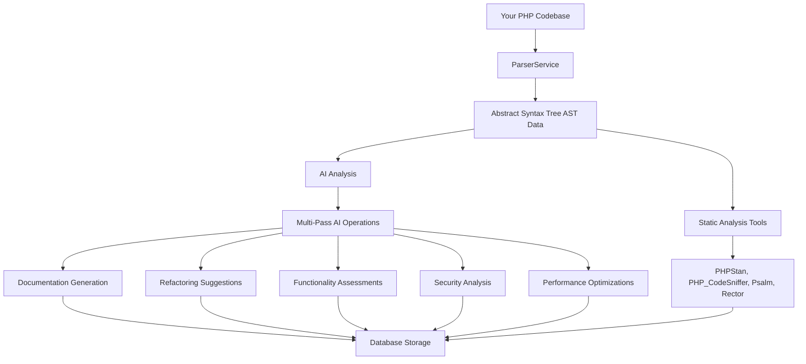
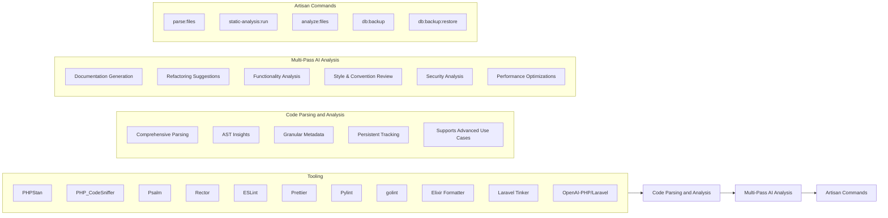

# Laravel AI Code Analysis Project

[](LICENSE)
[](https://github.com/wallter)
[](https://www.linkedin.com/in/tylerrwall/)

## Overview

This Laravel-based project seamlessly integrates **OpenAI’s language models** with **PHP Abstract Syntax Tree (AST) analysis** (powered by [nikic/php-parser](https://github.com/nikic/PHP-Parser)) along with other essential tooling such as [PHPStan](https://phpstan.org/), [PHP_CodeSniffer](https://github.com/squizlabs/PHP_CodeSniffer), [Psalm](https://psalm.dev/), [Rector](https://github.com/rectorphp/rector), [ESLint](https://eslint.org/), [Prettier](https://prettier.io/), [Pylint](https://www.pylint.org/), [golint](https://github.com/golang/lint), and Elixir’s formatter to deliver a **comprehensive multi-pass code analysis**. By iteratively scanning codebases across multiple languages, the system generates:

- **Automated Documentation**: Creates concise and clear documentation derived from raw code and AST data, enhancing code comprehension and maintainability.
- **Refactoring Suggestions**: Provides actionable recommendations to improve code clarity, adhere to best practices, and optimize overall structure.
- **Functionality Assessments**: Evaluates performance and maintainability aspects of the code, identifying potential bottlenecks and areas for improvement.
- **Security Analysis**: Identifies security vulnerabilities and suggests best practices to enhance code security.
- **Performance Optimizations**: Detects performance issues and recommends optimizations for efficient code execution.


By leveraging **queued** AI operations, **token usage** tracking, and other advanced features, developers can **enhance maintainability**, **optimize performance**, and **ensure** cleaner, more efficient codebases (see `config/ai.php`).

## Table of Contents

- [Laravel AI Code Analysis Project](#laravel-ai-code-analysis-project)
  - [Overview](#overview)
  - [Table of Contents](#table-of-contents)
  - [How it works](#how-it-works)
  - [Usage TLDR;](#usage-tldr)
    - [Running the UI & Server](#running-the-ui--server)
  - [Features](#features)
    - [Tooling](#tooling)
    - [Code Parsing and Analysis](#code-parsing-and-analysis)
    - [Multi-Pass AI Analysis](#multi-pass-ai-analysis)
    - [Artisan Commands](#artisan-commands)
  - [Requirements](#requirements)
  - [Installation](#installation)
  - [UI Setup](#ui-setup)
  - [Configuration](#configuration)
    - [AI Service Configuration](#ai-service-configuration)
    - [Parsing Configuration](#parsing-configuration)
  - [Usage](#usage)
    - [Artisan Commands](#artisan-commands-1)
    - [Token & Cost Tracking](#token--cost-tracking)
    - [Queued Analysis](#queued-analysis)
    - [Testing](#testing)
  - [Testing](#testing-1)
  - [Screenshots](#screenshots)
    - [Code Analysis Dashboard](#code-analysis-dashboard)
    - [Documentation Generation](#documentation-generation)
  - [Demo Output](#demo-output)
    - [Final Summary of Analysis for `ParseFilesCommand`](#final-summary-of-analysis-for-parsefilescommand)
    - [Strengths](#strengths)
    - [Areas for Improvement](#areas-for-improvement)
      - [Functionality Enhancements](#functionality-enhancements)
      - [Performance Optimizations](#performance-optimizations)
      - [Code Quality Improvements](#code-quality-improvements)
    - [Overall Rating and Recommendations](#overall-rating-and-recommendations)
  - [Contributing](#contributing)
  - [License](#license)

## How it works



## Usage TLDR;
```bash
composer install
npm install

# 1) Set up your .env with OPENAI_API_KEY, choose models
cp .env.example .env
php artisan key:generate

# 2) Migrate DB
php artisan migrate:fresh

# 3) Set your file/folder scanning in config/parsing.php

# 4) Run all static analyses and AI passes
php artisan static-analysis:run
php artisan analyze:files

# 5) Process queued jobs
php artisan queue:progress

# Alternatively, run all steps with a single command
composer run app

# Ensure you have a queue worker running if using asynchronous jobs
php artisan queue:work --stop-when-empty
```
- Check console output

### Running the UI & Server

Start the Laravel development server to run the application locally:

```bash
php artisan serve
```

The server will start at [http://localhost:8000](http://localhost:8000) by default. You can access the application by navigating to this URL in your web browser.
- Monitor Laravel logs `storage/logs/laravel.log` for detailed output

## Features



### Tooling

This project leverages a suite of powerful tools to enhance code analysis and maintainability:

- **[PHPStan](https://phpstan.org/):** A static analysis tool for PHP that focuses on finding bugs in your code without running it.
- **[PHP_CodeSniffer](https://github.com/squizlabs/PHP_CodeSniffer):** Detects violations of a defined coding standard in your PHP code.
- **[Psalm](https://psalm.dev/):** A static analysis tool for finding errors in PHP applications.
- **[Rector](https://github.com/rectorphp/rector):** An automated refactoring tool that upgrades and refactors your PHP code.
- **[ESLint](https://eslint.org/):** A static analysis tool for identifying problematic patterns found in JavaScript and TypeScript code.
- **[Prettier](https://prettier.io/):** An opinionated code formatter for maintaining consistent code style across JavaScript, TypeScript, and other languages.
- **[Pylint](https://www.pylint.org/):** A static code analyzer for identifying coding errors in Python.
- **[golint](https://github.com/golang/lint):** A linter for Go source code.
- **[Elixir Formatter](https://hexdocs.pm/elixir/1.12.2/elixir/Module.html#format/1):** A built-in formatter for Elixir code.
- **[Laravel Tinker](https://github.com/laravel/tinker):** An interactive REPL for the Laravel framework, aiding in debugging and testing.
- **[OpenAI-PHP/Laravel](https://github.com/openai-php/laravel):** Facilitates integration with OpenAI’s API for AI-driven features.

### Code Parsing and Analysis

- **Comprehensive Parsing:** Analyzes files across multiple languages to extract detailed information about classes, methods, functions, traits, and annotations, providing a holistic view of the codebase.
- **AST Insights:** Captures detailed AST data, including node types, attributes, and structural relationships, enabling advanced analysis of code structure and behavior.
- **Granular Metadata:** Extracts metadata such as namespaces, file paths, line numbers, and method parameters to facilitate in-depth understanding and precise debugging.
- **Persistent Tracking:** Stores parsed data in a database, allowing for historical tracking, cross-referencing, and analysis over time.
- **Supports Advanced Use Cases:** Enables scenarios like dependency mapping, identifying code smells, and generating tailored documentation or refactoring suggestions based on rich structural insights.

### Multi-Pass AI Analysis

- **Documentation Generation:** Automatically creates concise, structured documentation from both AST data and raw code. Summarizes class purposes, key methods, parameters, and usage context with clarity.
- **Refactoring Suggestions:** Offers actionable recommendations to improve code structure, maintainability, and adherence to SOLID principles, with a focus on reducing duplication and enhancing clarity.
- **Functionality Analysis:** Evaluates the code for functional correctness, identifies edge cases, and highlights performance bottlenecks. Provides suggestions for enhancing scalability, reliability, and testability.
- **Style & Convention Review:** Ensures adherence to PSR standards and highlights inconsistencies in formatting, naming conventions, and documentation. Recommends improvements for readability and consistency.
- **Security Analysis:** Identifies security vulnerabilities and recommends best practices to enhance code security.
- **Performance Optimizations:** Detects performance issues and suggests optimizations for efficient code execution.
- **Dependency Review:** Analyzes external dependencies for compatibility, security risks, and outdated packages. Recommends updates and alternatives for deprecated or inefficient libraries.

## Requirements

- **PHP:** >= 8.0
- **Composer:** To manage PHP dependencies.
- **Laravel:** Version 11.x
- **SQLite:** For the database.
- **OpenAI API Key:** To enable AI-driven features.
- **Node.js & npm:** For JavaScript/TypeScript tooling.
- **Python:** For running Pylint.
- **Go:** For running golint.
- **Elixir:** For running Elixir formatter.

## Installation

1. **Clone the Repository**

   ```bash
   git clone https://github.com/your-username/laravel-ai-code-analysis.git
   cd laravel-ai-code-analysis
   ```

2. **Install Dependencies**

   ```bash
   composer install
   npm install
   ```

3. **Set Up Environment Variables**

   - Copy the example environment file and configure the necessary variables.

     ```bash
     cp .env.example .env
     ```

   - Open `.env` and set your `OPENAI_API_KEY` along with other configurations as needed.

4. **Generate Application Key**

   ```bash
   php artisan key:generate
   ```

5. **Run Migrations**

   ```bash
   php artisan migrate
   ```

6. **Install Additional Tools**

   Depending on the static analysis tools you intend to use, install them via the appropriate package managers:

   - **Rector:**

     ```bash
     composer require rector/rector --dev
     ```

   - **JavaScript/TypeScript Tools:**

     ```bash
     npm install eslint prettier --save-dev
     npx eslint --init
     npx prettier --init
     ```

   - **Python Tools:**

     ```bash
     pip install pylint
     ```

   - **Go Tools:**

     ```bash
     go install golang.org/x/lint/golint@latest
     ```

   - **Elixir Tools:**

     Ensure Elixir and Mix are installed. The Elixir formatter is built-in.

## UI Setup

1. **Install Frontend Dependencies**

   Navigate to the `resources/js` directory and install the necessary npm packages:

   ```bash
   cd resources/js
   npm install
   ```

2. **Build Frontend Assets**

   Compile the frontend assets using Laravel Mix:

   ```bash
   npm run dev
   ```

   For production builds, use:

   ```bash
   npm run production
   ```

## Configuration

### AI Service Configuration

The AI capabilities are configured in `config/ai.php`. This file defines the AI operations, multi-pass analysis settings, static analysis tools, and default model configurations. Configure via `.env`.

- **API Credentials**

  ```php
  'openai_api_key' => env('OPENAI_API_KEY'),
  ```

- **Default AI Settings**

  ```php
  'default' => [
      'model'       => env('AI_DEFAULT_MODEL', 'gpt-3.5-turbo'),
      'max_tokens'  => env('AI_DEFAULT_MAX_TOKENS', 500),
      'temperature' => env('AI_DEFAULT_TEMPERATURE', 0.5),
      'system_message' => 'You are a helpful AI assistant.',
  ],
  ```

- **AI Operations**

  Define each AI operation with specific configurations.

  ```php
  'passes' => [

      'doc_generation' => [
          'operation_identifier' => OperationIdentifier::DOC_GENERATION->value,
          'model' => 'gpt-4o',
          'max_tokens' => env('AI_DOC_GENERATION_MAX_TOKENS', 1200),
          'temperature' => env('AI_DOC_GENERATION_TEMPERATURE', 0.25),
          'type' => PassType::BOTH->value,
          'system_message' => 'You generate concise PHP documentation from code and AST to complement phpdoc.',
          'prompt_sections' => [
              'base_prompt' => 'Analyze the following code:',
              'guidelines' => [
                  '- Create short but clear documentation from the AST data and raw code.',
                  '- Summarize the purpose, methods, parameters, and usage context.',
                  '- Avoid documenting __construct, getter, setter, and similar functions.',
                  '- Exclude comment code blocks from the documentation.',
                  '- Mention custom annotations, such as @url.',
                  '- Limit the documentation to approximately 200 words.',
              ],
              'response_format' => 'Provide concise, human-readable documentation.',
          ],
      ],

      // ... other passes ...

  ],
  ```

- **Static Analysis Tools Configuration**

  Define static analysis tools and their configurations.

  ```php
  'static_analysis_tools' => [
      'PHPStan' => [
          'enabled' => true,
          'command' => 'vendor/bin/phpstan',
          'options' => ['analyse', '--no-progress', '--error-format=json'],
          'output_format' => 'json',
          'language' => 'php',
      ],
      'PHP_CodeSniffer' => [
          'enabled' => true,
          'command' => 'vendor/bin/phpcs',
          'options' => ['--report=json'],
          'output_format' => 'json',
          'language' => 'php',
      ],
      'Psalm' => [
          'enabled' => true,
          'command' => 'vendor/bin/psalm',
          'options' => ['--output-format=json'],
          'output_format' => 'json',
          'language' => 'php',
      ],
      'Rector' => [
          'enabled' => true,
          'command' => 'vendor/bin/rector',
          'options' => ['process'],
          'output_format' => 'json',
          'language' => 'php',
      ],
      'ESLint' => [
          'enabled' => true,
          'command' => 'npx eslint',
          'options' => ['--format=json'],
          'output_format' => 'json',
          'language' => 'javascript',
      ],
      'Prettier' => [
          'enabled' => true,
          'command' => 'npx prettier',
          'options' => ['--check'],
          'output_format' => 'json',
          'language' => 'javascript',
      ],
      'Pylint' => [
          'enabled' => true,
          'command' => 'pylint',
          'options' => ['--output-format=json'],
          'output_format' => 'json',
          'language' => 'python',
      ],
      'golint' => [
          'enabled' => true,
          'command' => 'golint',
          'options' => ['./...'],
          'output_format' => 'json',
          'language' => 'go',
      ],
      'ElixirFormatter' => [
          'enabled' => true,
          'command' => 'mix',
          'options' => ['format', '--check-formatted'],
          'output_format' => 'text',
          'language' => 'elixir',
      ],
      // Add more tools as needed
  ],
  ```

- **Multi-Pass Analysis Order**

  Configure the order and specifics of each analysis pass.

  ```php
  'operations' => [
      'multi_pass_analysis' => [
          'pass_order' => [
              'doc_generation',
              'functional_analysis',
              'style_convention',
              'static_analysis',
              'consolidation_pass',
              'scoring_pass',
              'laravel_migration',
              'laravel_migration_scoring',
              'security_analysis',
              'performance_analysis',
          ],
      ],
  ],
  ```

### Parsing Configuration

In `config/parsing.php`, define:

- **Folders to scan (recursively) for various languages**
- **Specific files to parse**
- **Ignore patterns** similar to `.gitignore`

- **Analysis Limits**

  Set global limits to control the scope of analysis inside the `config/ai.php` configuration. Each of the `parse:files` and `code:analyze` commands offers options (`--limit-class=1 --limit-method=1`) to allow for fine-grained testing and calibration of AI prompts.

  ```php
  'analysis_limits' => [
      'limit_class'  => env('ANALYSIS_LIMIT_CLASS', 0),
      'limit_method' => env('ANALYSIS_LIMIT_METHOD', 0),
  ],
  ```

**File: `config/parsing.php`**
```php
<?php

return [
    /*
    |--------------------------------------------------------------------------
    | Files or Directories to Parse
    |--------------------------------------------------------------------------
    |
    | An array of paths (absolute or relative) that should be scanned when
    | no explicit arguments are passed to the parse commands. For example:
    | ('folders' OR 'files') => [
    |     base_path('app/Services'), // a directory
    |     base_path('app/Helpers.php'), // single file
    | ],
    |
    */
    'folders' => [
        // Directories to parse recursively for various languages
        base_path('resources/access-app'),
        base_path('resources/views'),
        base_path('resources/js'),
        base_path('resources/css'),
        base_path('resources/typescript'),
        base_path('resources/python'),
        base_path('resources/go'),
        base_path('resources/elixir'),
        // Add more directories as needed
    ],

    'files' => [
        // Individual files to parse
        // base_path('app/Models/CodeAnalysis.php'),
        // base_path('app/Services/AI/CodeAnalysisService.php'),
    ],

    /*
    |--------------------------------------------------------------------------
    | Ignore Patterns
    |--------------------------------------------------------------------------
    |
    | Patterns for paths you want excluded (equivalent to your .gitignore or
    | .aiderignore logic). You can adapt or remove if you’re managing this
    | differently.
    |
    */
    'ignore' => [
        '.git',
        'vendor',
        'node_modules',
        'storage',
        'bootstrap/cache',
        'public/vendor',
        'public/js',
        'public/css',
        'resources/js',
        'resources/css',
        'resources/typescript',
        'resources/python',
        'resources/go',
        'resources/elixir',
        'tests/Fixtures',
        'tests/Temporary',
        // etc.
    ],
];
```

## Usage

### Artisan Commands

1. **Parse Files**

   ```bash
   php artisan parse:files --output-file=docs/parse_all.json --verbose
   ```
   - **Description:** Collects files across multiple languages, stores discovered items (classes, functions, etc.) in the DB (via `ParsedItem` or similar).

2. **Run Static Analysis Tools**

   ```bash
   php artisan static-analysis:run
   ```
   - **Description:** Runs all enabled static analysis tools on `CodeAnalysis` entries that do not have existing static analyses.

3. **Analyze Files (Multi-Pass AI Operations)**

   ```bash
   php artisan analyze:files --output-file=docs/analyze_all.json --verbose
   ```
   - **Description:** 
     - Creates or updates a `CodeAnalysis` record for each file.
     - Queues AI passes based on the configured multi-pass analysis.

4. **DB Backup / Restore**

   ```bash
   php artisan db:backup
   php artisan db:backup:restore
   ```
   - **Description:** Backup or restore the SQLite DB as needed.

5. **Run Scripts (Optional)**

   If you have additional scripts or tools to run across different languages, consider adding corresponding Artisan commands or integrating them into existing commands.

- **Database Management**
  - Utilizes SQLite for simplicity and ease of use.
  - Provides migration files to set up necessary database tables.

- **Logging with Contextual Information**
  - Implements detailed logging using Laravel's Context facade for enhanced traceability and debugging.

## Token & Cost Tracking

- **OpenAIService** captures usage stats (`prompt_tokens`, `completion_tokens`, `total_tokens`) per request.
- **AIResult** stores the usage in `metadata->usage`.
- If desired, you can compute a cost estimate in USD by applying your own rate (e.g., $0.002 per 1K tokens).

*(See `ProcessAnalysisPassJob` or your service logic for examples.)*

### Queued Analysis

- **Multi-pass analysis** (e.g., doc generation, performance, style, security, etc.) is queued via `ProcessAnalysisPassJob`.
  - This prevents blocking the main process and improves reliability (retries on fail).
- **Ensure you have a queue worker running:**

  ```bash
  php artisan queue:work --stop-when-empty
  ```

- **Once completed, results are in `ai_results` table.**

### Testing

```bash
php artisan test
```

- **Coverage:** Some tests focus on AST parsing or command execution.
- **CI:** Integrate into GitHub Actions for continuous testing.

## Testing

The project includes PHPUnit tests to ensure the reliability of its features.

1. **Run Tests**

   ```bash
   php artisan test
   ```

2. **Test Structure**

   Tests are located in the `tests` directory and extend the base `TestCase` class. You can find feature tests for various commands and services.

## Screenshots

### Code Analysis Dashboard


### Documentation Generation


## Demo Output

<details>
<summary>Click to expand `composer app` output</summary>

### Final Summary of Analysis for `ParseFilesCommand`

The `ParseFilesCommand` class is a PHP console command designed to parse files across multiple languages and extract information about classes, methods, functions, traits, and annotations. The analysis has highlighted several strengths and areas for improvement regarding functionality, performance, error handling, code style, and compliance with language-specific standards.

---

### Strengths

1. **Well-Structured Code**: The code is modular and adheres to the single responsibility principle, making it relatively easy to follow and maintain.
2. **Comprehensive Language Support**: Supports multiple programming languages, enabling wide-ranging codebase analyses.
3. **Extensible Configuration**: Easily add or remove static analysis tools through configuration files, enhancing flexibility.
4. **Automated Documentation**: Generates clear and concise documentation, improving code maintainability.
5. **AI-Driven Insights**: Provides actionable refactoring suggestions and functionality assessments using AI, aiding in code optimization and reliability.
6. **Security and Performance Analysis**: Identifies potential security vulnerabilities and performance bottlenecks, contributing to robust and efficient codebases.

---

### Areas for Improvement

#### Functionality Enhancements

1. **Enhanced Language Detection**:
   - Improve the accuracy of language detection based on file extensions and content to ensure appropriate tools are applied.
2. **Tool-Specific Configurations**:
   - Allow for more granular configurations of each static analysis tool to cater to project-specific needs.
3. **Parallel Processing**:
   - Implement parallel processing for running static analysis tools to reduce total analysis time.

#### Performance Optimizations

1. **Efficient Database Queries**:
   - Optimize database interactions to handle large codebases more efficiently.
2. **Caching Mechanisms**:
   - Introduce caching for repeated analyses to decrease redundant processing.
3. **Resource Management**:
   - Monitor and manage system resources to prevent overconsumption during intensive analyses.

#### Code Quality Improvements

1. **Comprehensive Testing**:
   - Expand the test suite to cover more scenarios and edge cases, ensuring greater reliability.
2. **Logging Enhancements**:
   - Implement more detailed logging levels (info, warning, error) to aid in debugging and monitoring.
3. **Documentation Consistency**:
   - Ensure all methods and classes are uniformly documented for better developer understanding.
4. **Error Handling**:
   - Implement more robust error handling to gracefully manage unexpected issues during analyses.

---

### Overall Rating and Recommendations

- **Overall Rating**: **8.5/10**
  
- **Final Recommendations**:
  - Enhance language detection and tool configurations to better suit diverse projects.
  - Optimize performance through parallel processing and efficient resource management.
  - Expand the testing suite to cover a wider range of scenarios, ensuring robust and reliable analyses.
  - Improve logging and documentation practices to facilitate easier maintenance and debugging.

By addressing these recommendations, the Laravel AI Code Analysis Project can achieve higher efficiency, broader language support, and improved reliability, ultimately providing a more powerful tool for developers to maintain and optimize their codebases.

</details>

## Contributing

Contributions are welcome! Please follow these steps to contribute:

1. **Fork the Repository**

2. **Create a New Branch**

   ```bash
   git checkout -b feature/YourFeatureName
   ```

3. **Make Your Changes**

4. **Run Tests**

   Ensure all tests pass before submitting.

   ```bash
       # Optimize the code
       composer rector

       # Run Laravel Pint to format your code
       composer pint
   ```

5. **Commit Your Changes**

   ```bash
   git commit -m "Add your detailed description here"
   ```

6. **Push to Your Fork**

   ```bash
   git push origin feature/YourFeatureName
   ```

7. **Create a Pull Request**

   Submit a pull request outlining your changes and their purpose.

## License

This project is open-sourced software licensed under the [Apache License 2.0](https://github.com/IQAndreas/markdown-licenses/blob/master/apache-v2.0.md).

You may use, modify, and distribute this software under the terms of the Apache License. For more details, see the [LICENSE](LICENSE) file included in this repository.
