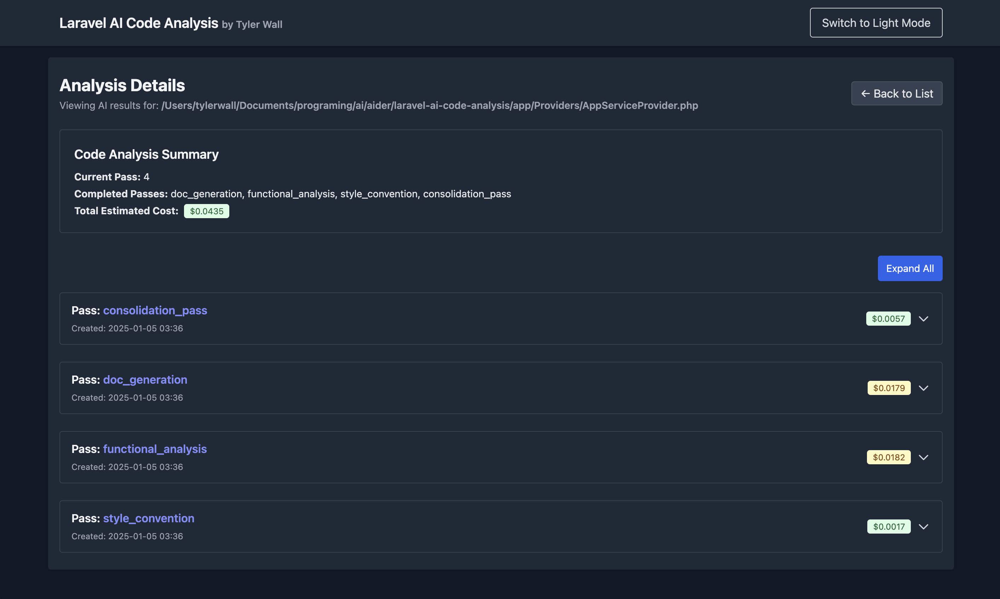
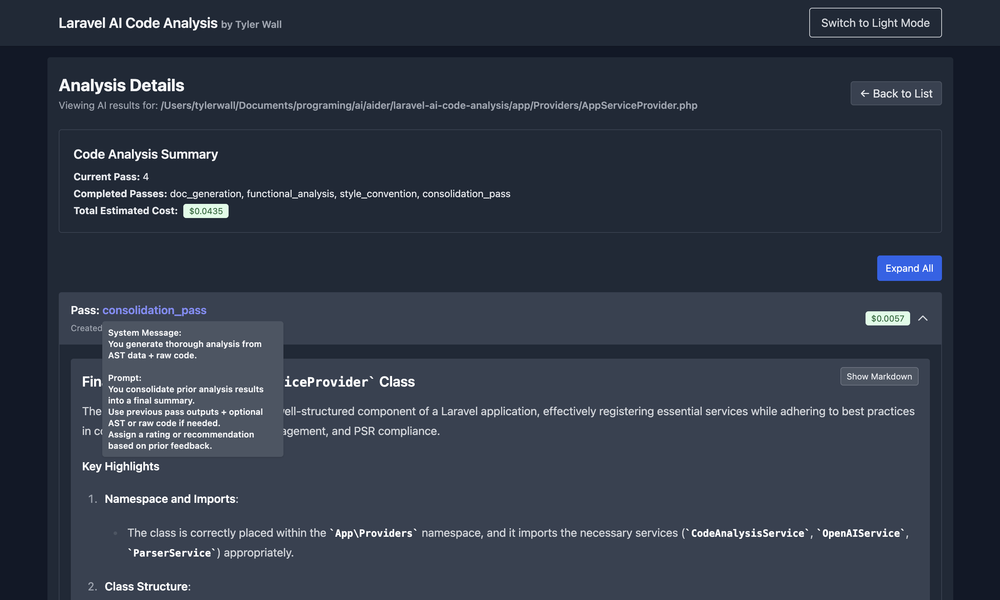

# Laravel AI Code Analysis Project

[](LICENSE)
[](https://github.com/wallter)
[](https://www.linkedin.com/in/tylerrwall/)

## Overview

This Laravel-based project uses **OpenAI’s language models** in tandem with **PHP Abstract Syntax Tree (AST) analysis** (via [nikic/php-parser](https://github.com/nikic/PHP-Parser)) to deliver a **comprehensive multi-pass code analysis**. It iteratively inspects PHP codebases, generating:

- **Automated Documentation** from raw code + AST data + previous AI Analysis "Passes"
- **Refactoring Suggestions** for clarity and adherence to best practices
- **Functionality Assessments** focusing on performance and maintainability

By leveraging **queued** AI operations, **token usage** tracking, and other advanced features, developers can **enhance maintainability**, **optimize performance**, and **ensure** cleaner, more efficient code (see `config/ai.php`).

## Table of Contents

- [Laravel AI Code Analysis Project](#laravel-ai-code-analysis-project)
  - [Overview](#overview)
  - [Table of Contents](#table-of-contents)
  - [Usage TLDR;](#usage-tldr)
    - [Running the UI \& Server](#running-the-ui--server)
  - [Features](#features)
    - [Code Parsing and Analysis](#code-parsing-and-analysis)
    - [Multi-Pass AI Analysis](#multi-pass-ai-analysis)
  - [Requirements](#requirements)
  - [Installation](#installation)
  - [UI Setup](#ui-setup)
  - [Configuration](#configuration)
    - [AI Service Configuration](#ai-service-configuration)
      - [Parsing Configuration](#parsing-configuration)
    - [Parsing Configuration](#parsing-configuration-1)
  - [Usage](#usage)
    - [Artisan Commands](#artisan-commands)
    - [Token \& Cost Tracking](#token--cost-tracking)
    - [Queued Analysis](#queued-analysis)
    - [Testing](#testing)
  - [Testing](#testing-1)
  - [Screenshots](#screenshots)
    - [Code Analysis Dashboard](#code-analysis-dashboard)
    - [Documentation Generation](#documentation-generation)
  - [Contributing](#contributing)
  - [License](#license)

## Usage TLDR;
```bash
# 1) Set up your .env with OPENAI_API_KEY, choose model
cp .env.example .env
php artisan key:generate

# 2) Migrate DB
php artisan migrate:fresh

# 3) Set your file/folder scanning in config/parsing.php

# 4) Parse code, store results:
php artisan parse:files

# 5) Analyze code, queue AI passes:
php artisan analyze:files

# 6) Process additional passes if needed:
php artisan passes:process

# 7) Run/Start queue processing to asyncronous proccess passes via OpenAI:
php artisan queue:work
```
- Check console output

### Running the UI & Server

Start the Laravel development server to run the application locally:

```bash
php artisan serve
```

The server will start at [http://localhost:8000](http://localhost:8000) by default. You can access the application by navigating to this URL in your web browser.
- Monitor Laravel logs `storage/logs/laravel.log` for detailed output

## Features

### Code Parsing and Analysis
- **Comprehensive Parsing:** Analyzes PHP files to extract detailed information about classes, methods, functions, traits, and annotations, providing a holistic view of the codebase.
- **Abstract Syntax Tree (AST) Insights:** Captures detailed AST data, including node types, attributes, and structural relationships, enabling advanced analysis of code structure and behavior.
- **Granular Metadata:** Extracts metadata such as namespaces, file paths, line numbers, and method parameters to facilitate in-depth understanding and precise debugging.
- **Persistent Tracking:** Stores parsed data in a database, allowing for historical tracking, cross-referencing, and analysis over time.
- **Supports Advanced Use Cases:** Enables scenarios like dependency mapping, identifying code smells, and generating tailored documentation or refactoring suggestions based on rich structural insights.

### Multi-Pass AI Analysis
  - **Documentation Generation:** Automatically creates concise, structured documentation from both AST data and raw code. Summarizes class purposes, key methods, parameters, and usage context with clarity.
  - **Refactoring Suggestions:** Offers actionable recommendations to improve code structure, maintainability, and adherence to SOLID principles, with a focus on reducing duplication and enhancing clarity.
  - **Functionality Analysis:** Evaluates the code for functional correctness, identifies edge cases, and highlights performance bottlenecks. Provides suggestions for enhancing scalability, reliability, and testability.
  - **Style & Convention Review:** Ensures adherence to PSR standards and highlights inconsistencies in formatting, naming conventions, and documentation. Recommends improvements for readability and consistency.
  - **Performance Analysis:** Identifies inefficiencies like redundant operations or excessive memory usage. Suggests optimizations such as caching, algorithmic improvements, or asynchronous processing.
  - **Dependency Review:** Analyzes external dependencies for compatibility, security risks, and outdated packages. Recommends updates and alternatives for deprecated or inefficient libraries.
  - **AST Insights:** Provides insights into the code structure and relationships using Abstract Syntax Tree (AST) data, helping to understand and navigate the codebase effectively.

***Future Enhancements**:* Multi-pass analysis will include dependent passes that reuse data for scoring recommendations, consolidating documentation, and producing detailed summaries.


- **Artisan Commands**
  - **`parse:files`:** Parses configured files/directories to list discovered classes and functions.
  - **`code:analyze`:** Analyzes PHP files, gathers AST data, and applies AI-driven multi-pass analysis.
  - **`passes:process`:** Processes AI analysis passes with options for dry-run and verbosity.
    
    - (experimental) **`generate:tests`:** Generates PHPUnit test skeletons for discovered classes and methods.
    - Database utilities:
      - **`db:backup`:** Backs up the SQLite database.
      - **`db:backup:restore`:** Restores the SQLite database from a backup file.
  
- **Database Management**
  - Utilizes SQLite for simplicity and ease of use.
  - Provides migration files to set up necessary database tables.
  
- **Logging with Contextual Information**
  - Implements detailed logging using Laravel's Context facade for enhanced traceability and debugging.

## Requirements

- **PHP:** >= 8.0
- **Composer:** To manage PHP dependencies.
- **Laravel:** Version 11.x
- **SQLite:** For the database.
- **OpenAI API Key:** To enable AI-driven features.

## Installation

1. **Clone the Repository**

   ```bash
   git clone https://github.com/your-username/laravel-ai-code-analysis.git
   cd laravel-ai-code-analysis
   ```

2. **Install Dependencies**

   ```bash
       composer install
   ```

3. **Set Up Environment Variables**

   - Copy the example environment file and configure the necessary variables.

     ```bash
     cp .env.example .env
     ```

   - Open `.env` and set your `OPENAI_API_KEY` along with other configurations as needed.

4. **Generate Application Key**

   ```bash
   php artisan key:generate
   ```

5. **Run Migrations**

   ```bash
   php artisan migrate
   ```

## UI Setup

1. **Install Frontend Dependencies**

   Navigate to the `resources/js` directory and install the necessary npm packages:

   ```bash
   cd resources/js
   npm install
   ```

2. **Build Frontend Assets**

   Compile the frontend assets using Laravel Mix:

   ```bash
   npm run dev
   ```

   For production builds, use:

   ```bash
   npm run production
   ```

## Configuration

### AI Service Configuration

The AI capabilities are configured in `config/ai.php`. This file defines the AI operations, multi-pass analysis settings, and default model configurations. Configure via `.env`.

- **API Credentials**

  ```php
  'openai_api_key' => env('OPENAI_API_KEY'),
  ```

- **Default AI Settings**

  ```php
  'default' => [
      'model'       => env('AI_DEFAULT_MODEL', 'gpt-4o-mini'),
      'max_tokens'  => env('AI_DEFAULT_MAX_TOKENS', 500),
      'temperature' => env('AI_DEFAULT_TEMPERATURE', 0.5),
      'system_message' => 'You are a helpful AI assistant.',
  ],
  ```

- **AI Operations**

  Define each AI operation with specific configurations.

  ```php
  'operations' => [
      'code_analysis' => [
          'driver'         => 'chat',
          'model'          => env('CODE_ANALYSIS_MODEL', 'gpt-4o-mini'),
          'max_tokens'     => env('CODE_ANALYSIS_MAX_TOKENS', 1500),
          'temperature'    => env('CODE_ANALYSIS_TEMPERATURE', 0.4),
          'system_message' => 'You are an assistant that generates comprehensive documentation from AST data. Focus on describing classes, methods, parameters, and the usage context.',
          'prompt'         => '',
      ],
      // Add additional operations as needed...
  ],
  ```

- **Multi-Pass Analysis**

  Configure the order and specifics of each analysis pass.

  ```php
  'multi_pass_analysis' => [
      'pass_order' => [
          'doc_generation',
          'refactor_suggestions',
          // Additional passes...
      ],
      'doc_generation' => [
          'operation'    => 'code_analysis',
          'type'         => 'both',
          'max_tokens'   => 1000,
          'temperature'  => 0.3,
          'prompt'       => 'Your prompt here...',
      ],
      'refactor_suggestions' => [
          'operation'    => 'code_improvements',
          'type'         => 'raw',
          'max_tokens'   => 1800,
          'temperature'  => 0.6,
          'prompt'       => 'Your prompt here...',
      ],
      // Additional pass definitions...
  ],
  ```
#### Parsing Configuration

In `config/parsing.php`, define:
	- Folders to scan (recursively) for .php files
	- Specific .php files to parse
	- The ParserService will gather AST data from these paths.

- **Analysis Limits**

  Set global limits to control the scope of analysis inside the `config/ai.php` configuration. Each of the `parse:files` and `code:analyze` commands offers options (`--limit-class=1 --limit-method=1`) to allow for fine graned testing and calibration of AI prompts. 

  ```php
  'analysis_limits' => [
      'limit_class'  => env('ANALYSIS_LIMIT_CLASS', 0),
      'limit_method' => env('ANALYSIS_LIMIT_METHOD', 0),
  ],
  ```

### Parsing Configuration

Parsing configuration is set up in `config/parsing.php`. This configuration determines what files or folders to (recursively) find and parse PHP files in—kicked off by the ParseFilesCommand (`php artisan parse:files --output-file=docs/parse_all.json --verbose`) while parsing is handled by `app/Services/Parsing/ParserService.php`.

## Usage

### Artisan Commands
1. **Parse Files**

   ```bash
   php artisan parse:files --output-file=docs/parse_all.json --verbose
   ```
   - **Description:** Collects PHP files, stores discovered items (classes, functions) in the DB (via ParsedItem or similar).

2. **Analyze Files (Multi-Pass)**

   ```bash
   php artisan analyze:files --output-file=docs/analyze_all.json --verbose
   ```
   - **Description:** 
     - Creates or updates a CodeAnalysis record for each file.
     - Queues AI passes if using the new asynchronous approach.

3. **Process Passes**

   ```bash
   php artisan passes:process
   ```
   - **Description:** 
     - Finds any CodeAnalysis needing further passes and dispatches them to the queue.
     - Use `--dry-run` to test logic without storing AI results, `--verbose` for extra logs.

4. **Generate Tests (experimental)**

   ```bash
   php artisan generate:tests
   ```
   - **Description:** Creates or updates test files for discovered classes & methods (in progress).

5. **DB Backup / Restore**

   ```bash
   php artisan db:backup
   php artisan db:backup:restore
   ```
   - **Description:** Backup or restore the SQLite DB as needed.

### Token & Cost Tracking
- **OpenAIService** captures usage stats (`prompt_tokens`, `completion_tokens`, `total_tokens`) per request.
- **AIResult** stores the usage in `metadata->usage`.
- If desired, you can compute a cost estimate in USD by applying your own rate (e.g., $0.002 per 1K tokens).

*(See `ProcessAnalysisPassJob` or your service logic for examples.)*

### Queued Analysis
- **Multi-pass analysis** (e.g., doc generation, performance, style, etc.) is queued via `ProcessAnalysisPassJob`.
  - This prevents blocking the main process and improves reliability (retries on fail).
- **Ensure you have a queue worker running:**

  ```bash
  php artisan queue:work
  ```

- **Once completed, results are in `ai_results` table.**

### Testing
- **Run Tests:**

  ```bash
  php artisan test
  ```

- **Coverage:** Some tests focus on AST parsing or command execution.
- **CI:** Integrate into GitHub Actions for continuous testing.

## Testing

The project includes (some unmaintained ... yes, got a bit lazy here) PHPUnit tests to ensure the reliability of its features.

1. **Run Tests**

   ```bash
   php artisan test
   ```

2. **Test Structure**

   Tests are located in the `tests` directory and extend the base `TestCase` class. You can find feature tests for various commands and services.

## Screenshots

### Code Analysis Dashboard


### Documentation Generation




## Contributing

Contributions are welcome! Please follow these steps to contribute:

1. **Fork the Repository**

2. **Create a New Branch**

   ```bash
   git checkout -b feature/YourFeatureName
   ```

3. **Make Your Changes**

4. **Run Tests**

   Ensure all tests pass before submitting. (Do any tests pass ¯\_(ツ)_/¯)

   ```bash
   php artisan test
   ```

5. **Commit Your Changes**

   ```bash
   git commit -m "Add your detailed description here"
   ```

6. **Push to Your Fork**

   ```bash
   git push origin feature/YourFeatureName
   ```

7. **Create a Pull Request**

   Submit a pull request outlining your changes and their purpose.

## License

This project is open-sourced software licensed under the [Apache License 2.0](https://github.com/IQAndreas/markdown-licenses/blob/master/apache-v2.0.md).

You may use, modify, and distribute this software under the terms of the Apache License. For more details, see the [LICENSE](LICENSE) file included in this repository.

